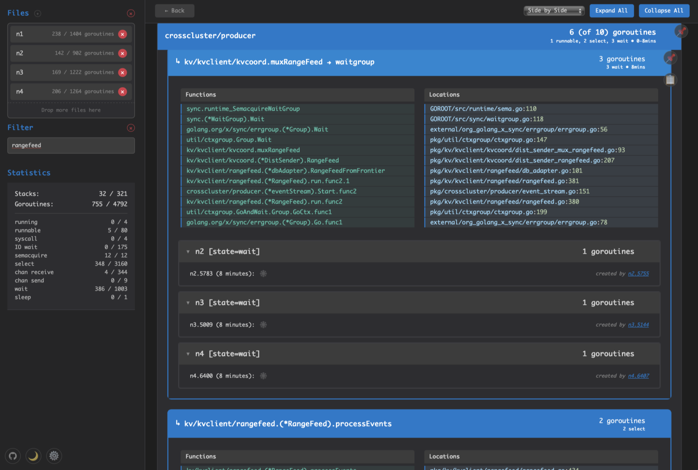

# Stackgazer

An interactive tool for analyzing Go stack trace dumps (goroutine profiles).

Stackgazer designed to make browsing and searching profiles containing larger numbers of goroutines easier, particularly when analyzing a collection of many profiles captured from separate but related processes in a distributed system or service e.g. CockroachDB.

[**⚡ Live Demo**](https://davidt.io/stackgazer)



## Features

- **Responsive, Quick Filtering**: Rapidly filter stacks by keywords or attributes.
- **Customizable Categorization**: Hierarchical organization of related and identical stacks for faster browsing, using configurable rules to determine groups and useful and informative names.
- **Interactive Navigation**: Navigate between creator/created goroutines with clickable links with previews, or browse in a zoomable tree.
- **Multi-process/multi-file Analysis**: Combines and groups stack traces captured from multiple processes/nodes in a distributed system. Files can be added individually or en-masse via zip file. 
  - Customizable rules can name files based on labels or extracting arguments from debug=2 stack frames (e.g. if you expect a stack to have a server.start() frame which includes a serverID as an argument, you can use a pattern to extract that ID to use as the file name).
- **Multiple Display Modes**: Different viewing options for stack traces and goroutines.
- **Support Multiple Formats**: supports all three goroutine profile formats: debug=2 (aka backtace), debug=1 (text with labels), and debug=0 (compressed pprof proto).
- **Local analysis**: Everything is processed locally in the browser; nothing is uploaded.
- **Customizable Settings**: Behavior can be customized through locally stored settings with configurable defaults

### Categorization and Naming

Goroutines with the same stack are grouped together, and stacks are grouped into categories. How categories are chosen and how the stacks within them are named can be controlled by configurable rules with both built-in defaults and custom overrides.

#### Stack Categorization Rules

Categorization groups goroutines based on where they originated, as goroutines tend to be performing related tasks. When investigating a part of the system, it's often useful to see the goroutines that part of the system created grouped together. Categorization rules help achieve this by letting you skip common utilities or libraries that launch goroutines, and group them by where they started running feature code.

* **Skip Rules** - Skip over utility/library frames for categorization purposes
  * Examples: `sync.`, `internal/`, `google.golang.org/grpc`
  * Purpose: Skip `sync.WaitGroup`, even though it is what technically did directly call `go()`; if the next frame is `kv/kvserver/raft/raftserver.func2` that can determine the category for this goroutine that was launched to run kvserver work rather than just the common "sync" package, even if that was its first frame.
* **Match Rules** - Extract category names using regex patterns  
  * Default: `s|^((([^\\/.]*\\\\.[^\\/]*)*\\/)?[^\\/.]+(\\/[^\\/.]+)?)|$1|`
  * Purpose: Extract meaningful grouping prefix e.g. `kv/kvserver` from `kv/kvserver/raftserver.func2`

#### Stack Naming Rules

Stack names communicate what a goroutine is doing now - whether it sent a request for a payload and is waiting for it, is blocked on a mutex, or is processing data. A clear, descriptive name helps you quickly understand and find the ones with state you wish to inspect further. 

Naming rules allow skipping over uninteresting frames, to get to more informative ones or distinguishing frames that typically follow, or combining multiple frames to make a more useful name. Many stacks may end up in the same `sync` function (Lock/Cond.Wait/etc) so the next frame, and/or a frame pulled from further down, may better identify that a backup writer stack vs a user cache poller stack, even if both ultimately end up on a mutex acquisition. Additionally, function names can be noisy for human eyes -- the full package path, `(*Pointer)`, and .funcN, etc -- so rules to trim or replace noise can aid in readability. 

Names are purely for display, so we can manipulate them entirely for ease of reading by humans without losing information; this manipulation is purely on the name, so the full, unaltered stack remains untouched.

The naming system starts from the top frame and applies multiple rule types in sequence to determine which frame or frames determine the stack name and transform them in the process:

* **Skip Rules** - Skip uninformative frames when generating names
  * Examples: `sync.runtime_Semacquire`, `golang.org/x/sync/errgroup.(*Group).Wait`
  * Usage: Skip runtime semaphore frames to show more meaningful context

* **Trim Rules** - Remove common patterns and prefixes
  * Examples: `s|\\.func\\d+(\\.\\d+)?$||` (removes .func1, .func2, etc.)
  * Usage: Clean up anonymous function suffixes for readability

* **Fold Rules** - Combine several frames into a single name.
  * Format: `s|pattern,while|replacement|` (`,while` is optional).
  * Matches a target frame via `pattern`, and then combines the name determined by _subsequent frames_ with the short, specified `replacement`, to yield the full stack name.
  * If optional `while` pattern is specified, subsequent frames matching it are skipped prior to choosing the next frame to determine the remaining prefix of the stack name.
  * Examples:
    - `s|sync.(*WaitGroup).Wait,|waitgroup|`: if the penultimate frame is `foo/bar()` which then calls `WaitGroup.wait()`, such a fold would produce `foo/bar -> waitgroup`.
    - `s|util/admission.(*WorkQueue).Admit,util/admission|AC|` → like the waitgroup example, but skips over any additional layers of admission's internal calls, to get to `foo/bar -> AC` even if there are several ac methods which ultimately end up in `Admit()`.
    - `s|internal/poll.runtime_pollWait,stdlib|netpoll|` → shows "netpoll" for network polling, similar to the AC fold, that used a `while` pattern to keep skipping all AC frames until it got to the "external" caller, but uses the special-case "stdlib" pseudo-pattern.

* **Find Rules** - Search deeper into the stack after a partial name has been determined to see if additional frames should be incorporated into it.
  * Format: `s|pattern,while|replacement|` with complex while-patterns for context
  * Details: After a name has been determined i.e. a non-skipped, non-folded frame is found, find rules have an opportunity to search the remainder of the stack for frames matching pattern and resume name determination there. If a frame matches a find rule, the replacement is prepended to the name constructed so far and then name construction continues at the following frame, or the frame after any following frames that match the optional while rule. A find rule can be useful to highlight a component boundary so that the full name shows the caller prior to the boundary as well
  * Example: a rule like `s|core/filemanager.FileManager|files|` could turn a stack where a backup process had to call into the file manager where it ultimately waited for admission queues into: `backup.runBackupProcessor → files → admission.(*Queue).Wait()`. 

Fold and find rules accumulate a suffix of extracted name parts as they work downwards through stack frames. Putting this all together: 
- the top frame is an admission `Admit()` call; fold rule folds it to a `-> AC` suffix and skips the following admission-related frames with its `while`, arriving at.
- the frame after AC fold is `core/FileReader.ReadAt.func4()`, no skip or fold rules match it, so it tentatively determines the name, and a trim rule removes `.func4`, meaning that combined with our previously accumulated suffix, we have `core/FileReader.ReadAt -> AC`.
- Find rules get a chance to search for additional frames to include, finding the `core/filemanager.FileManager` frame, adding `files ->` to our suffix, and moving on to
- `backup.runBackupProcessor.func6`, which is not skipped or folded, so it too is trimmed.
- Our final, folded, trimmed and find-augmented display name for this stack is thus `backup.runBackupProcessor → files → core/FileReader -> AC`

#### Rule Syntax Examples

**Category Skip Rules:**
```
sync.
internal/
google.golang.org/grpc
your/custom/package
```

**Naming Fold Rules:**
```
s|sync.(*WaitGroup).Wait,|waitgroup|
s|your.(*CustomType).Method,|custom|
s|stdlib.pattern,stdlib|shortened|
```

### Other Configuration Options

- **Function/File Trimming**: Remove common prefixes from function names and file paths during parsing, affecting naming, categorization, and displayed stack traces.

Settings can be customized in the UI, and default settings can be customized when the application is initialized by providing custom defaults as arguments.

## Contributing

### Prerequisites

- Node.js (version 18 or higher)
- npm

### Building

```bash
# Install dependencies
npm install

# Build the standalone application
npm run build:bundle

# Development build with file watching
npm run watch

# Serve locally for development
npm run serve
```

### Testing

```bash
# Run all tests
npm test

# Run with coverage
npm run test:coverage

# Run UI tests specifically
npm run test:ui

# Run all test suites
npm run test:all
```

### Development Workflow

1. Make changes to TypeScript source files in `src/`
2. Run `npm run build:bundle` to create the standalone HTML bundle
3. Test your changes with `npm test`
4. Format code with `npm run format`

The build process creates a single standalone HTML file in `dist/index-standalone.html` that contains all CSS, JavaScript, and dependencies bundled together.

### Architecture

The app uses a three-layer architecture:

- **Parser Layer** (`src/parser/`): Handles parsing stack traces and ZIP files
- **App Layer** (`src/app/`): Core data management, filtering, and business logic
- **UI Layer** (`src/ui/`): DOM manipulation and user interactions

Key components:
- `ProfileCollection.ts`: Core data management and filtering
- `StackTraceApp.ts`: Main application UI controller
- `SettingsManager.ts`: Configuration and settings persistence
- `AppState.ts`: Navigation history and state management